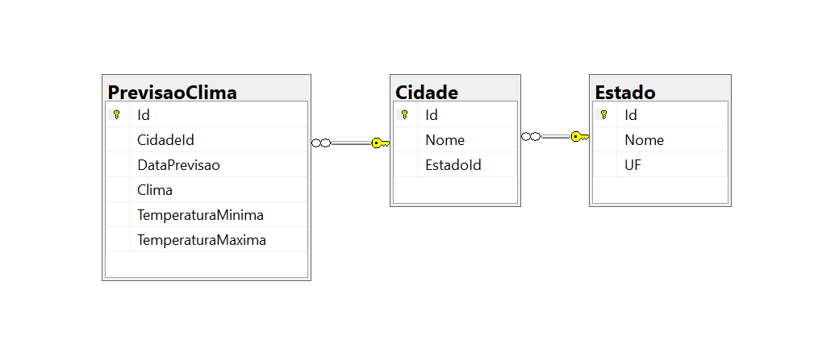

# Clima-Tempo

**Visite <http://climatempo.marcioramos.com.br>**

## Montar base de dados

- O arquivo [Clima-Tempo/App_Data/sistema_consulta_clima.sql](Clima-Tempo/App_Data/sistema_consulta_clima.sql) cria o banco de dados <b>ClimaTempoSimples</b> e faz uma carga inicial.

- O arquivo [Clima-Tempo/App_Data/sistema_consulta_clima_novo_dados.sql](Clima-Tempo/App_Data/sistema_consulta_clima.sql) insere mais dados de previsão do tempo para as cidades com base nos que já existe.




## Ajustar Conexão

#### web.config
```xml
<connectionStrings>
    <add name="ContextoBd" 
         connectionString="data source=localhost\SQLExpress;initial catalog=ClimaTempoSimples;persist security info=True;user id=sa;password=xxxxxx;MultipleActiveResultSets=True;App=EntityFramework" 
         providerName="System.Data.SqlClient" />
</connectionStrings>
```
